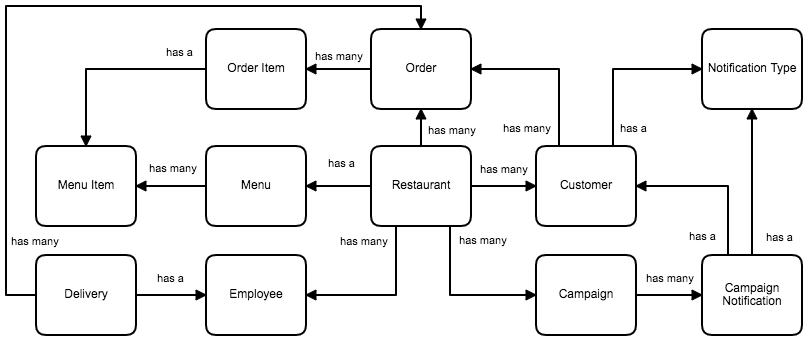
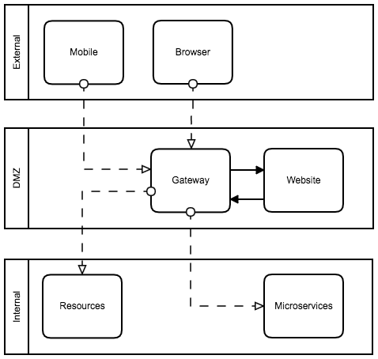
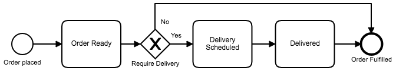

# Pizzeria Coding Exercise

## Requirement
We’re starting up a pizzeria - and we need to compete with the big players when it comes to cool tech.

So, we need you to architect a solution that will support 

- In-Store & Online Orders via the Web & Mobile Apps
- Customers getting GPS Location of their Pizza Delivery
- Multi-Order Delivery Routing for Delivery Drivers
- Notifying Customers of specials or order status via SMS & Push Notifications

You can assume that GPS, Routing Maps, SMS & Push Notification Services are provided by 3rd-Party Web Services.

You’ll also want to give our Pizzeria an awesome name, then share with us on GitHub.

## Technology

- Java
- Spring Boot
- Spring Data
- Spring Cloud Zuul
- Angular
- Material
- JUnit

## Conceptual Model

I began with building a basic conceptual model below.

## Basic Architecture

I decided to use an API Gateway pattern so that I could have a single entry point for all clients. I also chose an edge architecture so that the API Gateway could be deployed in a DMZ in order to protect all other resources behind a firewall.

## Order Process

An assumption was made that the payment was made before order was placed, either online or in store.

